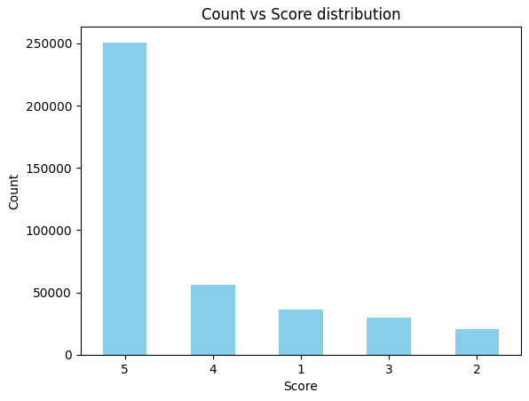
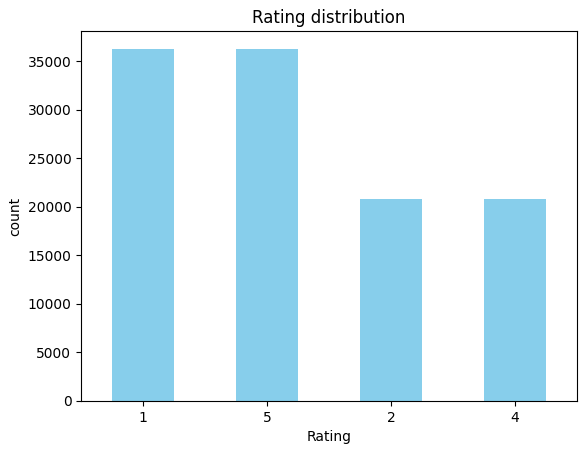
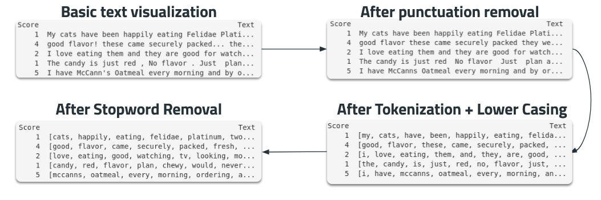
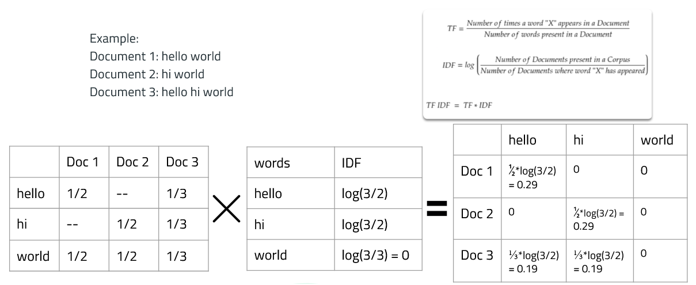
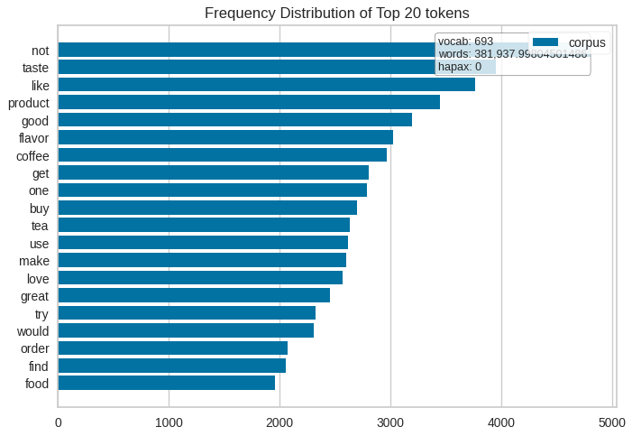
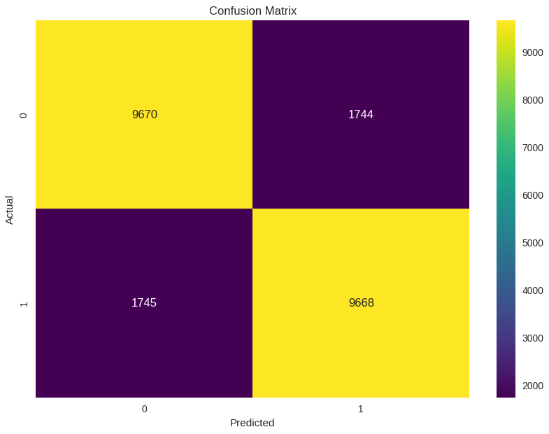
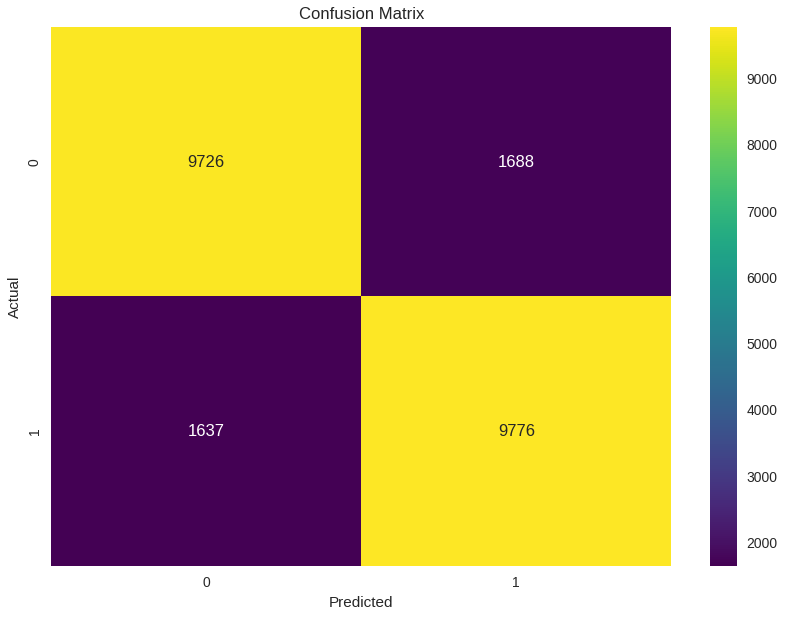

# Sentiment Analysis of Amazon Reviews With Ensemble Method

## Project Overview
In this project, we'll classify the sentiment of Amazon reviews. We'll use NLP preprocessing and TF-IDF to extract features and then create a VotingClassifier ensemble model to determine review sentiment
Out ensemble mdel will help classify reviews without relying on ratings. Providing insight into whether a customer is happy or not

## Note
- Please review the `'amaRev.ipynb'` first. It has all of the details and reasoning explained thoroughly.
- This `'README'` will just be used to showcase visuals and minimal examples of the project.

## Intro to Dataset
- Prior to balacing the dataset

- After balacing the dataset, keeping the difference of 1 star and 2 star reviews

## NLP Preprocessing
- These are some of the steps done for the NLP preprocessing, to see all, check `'amaRev.ipynb'`

## TF-IDF for Feature Extraction

### Examples of Feature Frequency

## Models Results
- Logistic Regression

- Ensemble Model

# Conclusion

### Logistic Regression VS Ensemble Model
The performance difference between the logistic regression and ensemble model were minimal, with metrics such as precision, recall, and F1 score showing a 1% advantage for the ensemble method. Despite this, the longer training time required by the ensemble model indicates that logistic regression is a better choice for companies prioritizing runtime efficiency

### Addressing Stopwords
Attempting to preserve sentiment in the reviews, we retained negation words in our analysis. However, this resulted in the word 'not' becoming the most frequently used term in our vocabulary, as shown in the 'Frequency Distribution of Top 20 Tokens.' The high frequency of 'not' indicates that we should remove it to improve model performance, while other negation words can still retain important meaning

### TF-IDF Optimization
- `'min_df'` - We've removed words that appear in less than 1% of our documents to potentially prevent overfitting and to handle words that are too rare to make an impact
- `'max_features'` - Based on experimentaion, I found that setting `max_features` to 20,000 words is generating the best results. This experimentation was done with consideration to the changes `min_df` had brought to the vocabulary

### What can be done to improve this project
- Running a grid search on the SVC and hyperparameter tuning on both the Logistic Regression and ensemble models can further improve their performance
- Implementing a deep learning model such as RNN can improve the accuracy of the sentiment analysis
- While TF-IDF is fitting for this project well, it does have limitations in capturing relationships between words. To improve the analysis, incorporating word embeddings can extract better information by using contextual and semantic similarities of words
